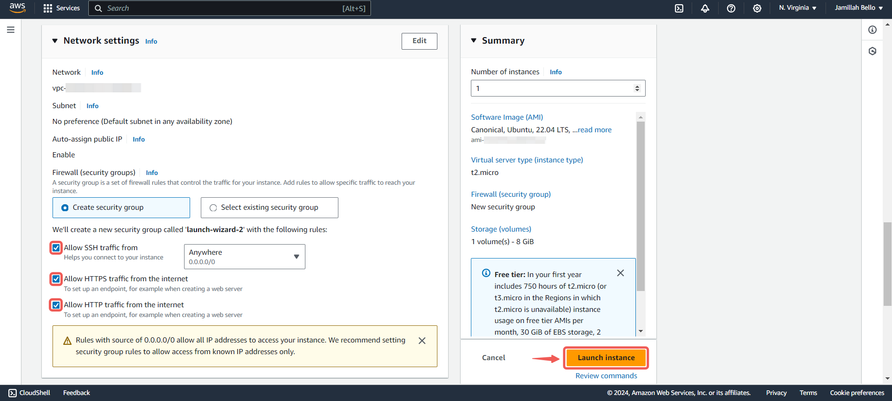

# Setup a Static Website Using Nginx

|S/N | Project Tasks                                                                   | Key Concepts Covered |
|----|---------------------------------------------------------------------------------|----------------------|
| 1  |Buy a domain name from a domain Registrar                                        | DNS                  |
| 2  |Spin up a Ubuntu server & assign an elastic IP to it                             | Linux                |
| 3  |SSH into the server and install Nginx                                            | Webserver            |
| 4  |Download freely available HTML website files                                     | Nginx                |
| 5  |Using SCP, copy the website files to the Nginx website directory                 | Dig command          |
| 6  |Validate the website using the server IP address                                 | SSL (Letsencrypt)    |
| 7  |In your DNS account, create an A record and add the Elastic IP                   | OpenSSL command      |
| 8  |Use the dig command to verify the DNS records                                    |                      |
| 9  |Using DNS verify the website setup                                               |                      |
| 10 |Create a Letsencryp certificate for the DNS and configure it on the Nginx server |                      |
| 11 |Validate the website SSL using the OpenSSL utility                               |                      |

## Checklist

- [x] Task 1: Buy a domain name from a domain Registrar.
- [x] Task 2: Spin up a Ubuntu server & assign an elastic IP to it.
- [x] Task 3: SSH into the server and install Nginx.
- [x] Task 4: Find freely available HTML website files.
- [x] Task 5: Download and unzip the website files to the Nginx website directory.
- [x] Task 6: Validate the website using the server IP address.
- [x] Task 7: In your DNS account, create an A record and add the Elastic IP.
- [x] Task 8: Use the dig command to verify the DNS records.
- [x] Task 9: Using DNS verify the website setup.
- [ ] Task 10: Create a Letsencryp certificate for the DNS and configure it on the Nginx server.
- [ ] Task 11: Validate the website SSL using the OpenSSL utility.

## Documentation

### Create An Ubuntu Server

- Find and click on **EC2** in the AWS management console.

- Click on **Launch Instance**

- **Name** your instance and select the **Ubuntu** AMI.

- Click on the **Create new key pair** button to create a key pair for secure connection to your instance.

- Set a **Key pair name** and click on **Create key pair**.

- Allow **SSH**, **HTTP**, **HTTPS** access and then click **Launch instance**.

:::note
For security reasons it's better to allow SSH access only from yor IP, but for the sake of this documentation i allowed access from anywhere.
:::

- Click on the created instance.

- Click on the **Connect** button.

- Copy the command given.

- Launch a terminal within the directory where your `.pem` file was downloaded, and then paste the command.

---

### Create And Assign an Elastic IP

