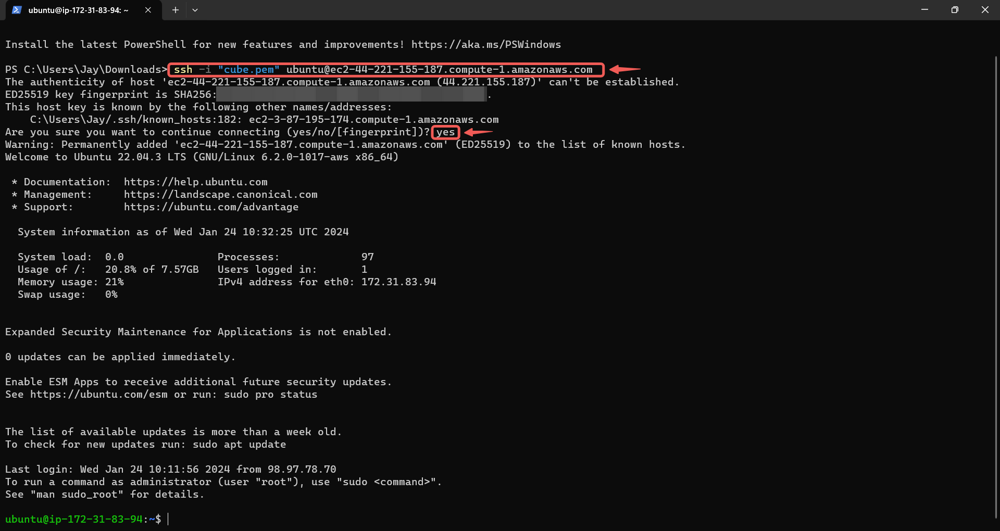

# Setup a Static Website Using Nginx

|S/N | Project Tasks                                                                   | Key Concepts Covered |
|----|---------------------------------------------------------------------------------|----------------------|
| 1  |Buy a domain name from a domain Registrar                                        | DNS                  |
| 2  |Spin up a Ubuntu server & assign an elastic IP to it                             | Linux                |
| 3  |SSH into the server and install Nginx                                            | Webserver            |
| 4  |Download freely available HTML website files                                     | Nginx                |
| 5  |Using SCP, copy the website files to the Nginx website directory                 | Dig command          |
| 6  |Validate the website using the server IP address                                 | SSL (Letsencrypt)    |
| 7  |In your DNS account, create an A record and add the Elastic IP                   | OpenSSL command      |
| 8  |Use the dig command to verify the DNS records                                    |                      |
| 9  |Using DNS verify the website setup                                               |                      |
| 10 |Create a Letsencryp certificate for the DNS and configure it on the Nginx server |                      |
| 11 |Validate the website SSL using the OpenSSL utility                               |                      |

## Checklist

- [x] Task 1: Buy a domain name from a domain Registrar.
- [x] Task 2: Spin up a Ubuntu server & assign an elastic IP to it.
- [x] Task 3: SSH into the server and install Nginx.
- [x] Task 4: Find freely available HTML website files.
- [x] Task 5: Download and unzip the website files to the Nginx website directory.
- [x] Task 6: Validate the website using the server IP address.
- [x] Task 7: In your DNS account, create an A record and add the Elastic IP.
- [x] Task 8: Use the dig command to verify the DNS records.
- [x] Task 9: Using DNS verify the website setup.
- [x] Task 10: Create a Letsencryp certificate for the DNS and configure it on the Nginx server.
- [x] Task 11: Validate the website SSL using the OpenSSL utility.

## Documentation

### Create An Ubuntu Server

- Find and click on **EC2** in the AWS management console.

- Click on **Launch Instance**

- **Name** your instance and select the **Ubuntu** AMI.

- Click on the **Create new key pair** button to create a key pair for secure connection to your instance.

- Set a **Key pair name** and click on **Create key pair**.

- Allow **SSH**, **HTTP**, **HTTPS** access and then click **Launch instance**.

> [!NOTE]
For security reasons it's better to allow SSH access only from yor IP, but for the sake of this documentation i allowed access from anywhere.

- Click on the created instance.

- Click on the **Connect** button.

- Copy the command given under **`SSH client`** .

- Launch a terminal within the directory where your `.pem` file was downloaded, and then paste the command.

---

### Create And Assign an Elastic IP

- Return to your AWS console and click on **Elastic IPs** in **Network & Security**.

- Click on the **Allocate Elastic IP address** button.

- Leave the settings as is and click on **Allocate**.

- **Associate this Elastic IP address** with your running instance.

- Choose the instance you want to associate the elastic IP address with, and then click on **Associate**.

> [!NOTE]
The IP for your instance has been changed to the elastic IP associated with it, so you'd have to SSH into your instance again. Return to the connection page of your instance and copy the new command.

- Paste the **command** into your terminal and click on **yes** to connect.

---

### Install Nginx and Setup Your Website

- Run the following commands.

`sudo apt update`

`sudo apt upgrade`

`sudo apt install nginx`

- Start your Nginx server by running the `sudo systemctl start nginx` command, enable it to start on boot by running the `sudo systemctl enable nginx` command, and then confirm if it's running, using the `sudo systemctl status nginx` command.

- Visit your instances IP address to view the default Nginx startup page.

- Download your website template from your preferred website.

> [!NOTE]
I downloaded my template from **tooplate.com** using the `sudo curl -o /var/www/html/2137_barista_cafe.zip https://www.tooplate.com/zip-templates/2137_barista_cafe.zip` command.
The `curl` command is a command-line tool for making HTTP requests. It is used here to download a file from a URL.
The `-o` option specifies the output file or location. In this case, it indicates that the downloaded file should be saved as **"2137_barista_cafe.zip"** in the **"/var/www/html/"** directory.
And `https://www.tooplate.com/zip-templates/2137_barista_cafe.zip` is the URL from which the file is being downloaded. The content located at this URL will be fetched by curl.

- Unzip your website content.

- Visit your Elastic IP address to confirm that your website is running.

