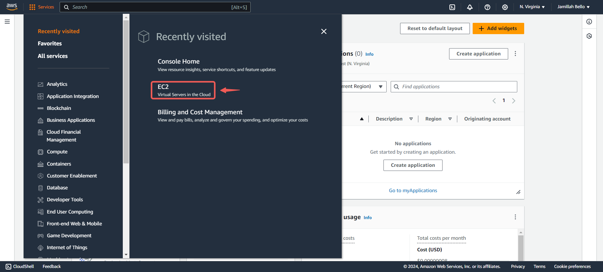
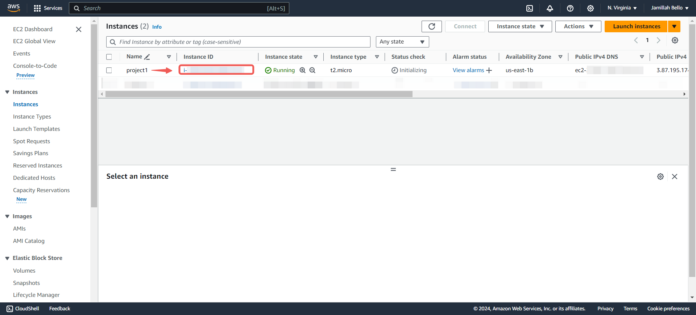
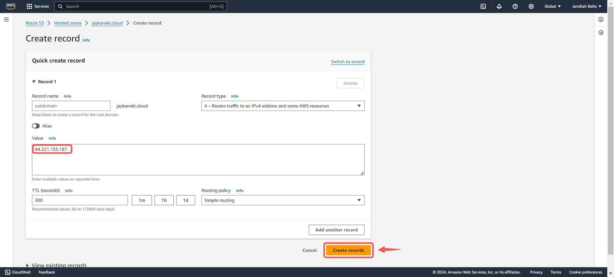

# Setup a Static Website Using Nginx

|S/N | Project Tasks                                                                   | Key Concepts Covered |
|----|---------------------------------------------------------------------------------|----------------------|
| 1  |Buy a domain name from a domain Registrar                                        | DNS                  |
| 2  |Spin up a Ubuntu server & assign an elastic IP to it                             | Linux                |
| 3  |SSH into the server and install Nginx                                            | Webserver            |
| 4  |Download freely available HTML website files                                     | Nginx                |
| 5  |Using SCP, copy the website files to the Nginx website directory                 | Dig command          |
| 6  |Validate the website using the server IP address                                 | SSL (Letsencrypt)    |
| 7  |In your DNS account, create an A record and add the Elastic IP                   | OpenSSL command      |
| 8  |Use the dig command to verify the DNS records                                    |                      |
| 9  |Using DNS verify the website setup                                               |                      |
| 10 |Create a Letsencryp certificate for the DNS and configure it on the Nginx server |                      |
| 11 |Validate the website SSL using the OpenSSL utility                               |                      |

## Checklist

- [x] Task 1: Buy a domain name from a domain Registrar.
- [x] Task 2: Spin up a Ubuntu server & assign an elastic IP to it.
- [x] Task 3: SSH into the server and install Nginx.
- [x] Task 4: Find freely available HTML website files.
- [x] Task 5: Download and unzip the website files to the Nginx website directory.
- [x] Task 6: Validate the website using the server IP address.
- [x] Task 7: In your DNS account, create an A record and add the Elastic IP.
- [x] Task 8: Use the dig command to verify the DNS records.
- [x] Task 9: Using DNS verify the website setup.
- [x] Task 10: Create a Letsencryp certificate for the DNS and configure it on the Nginx server.
- [x] Task 11: Validate the website SSL using the OpenSSL utility.

## Documentation

### Create An Ubuntu Server

- Locate and click on **EC2** within the AWS management console.

- Click on **Launch Instance**

- **Name** your instance and select the **Ubuntu** AMI.

- Click the **Create new key pair** button to generate a key pair for secure connection to your instance.

- Enter a **Key pair name** and click on **Create key pair**.

- Enable **SSH**, **HTTP**, and **HTTPS** access, then proceed to click **Launch instance**.

> [!NOTE]
For security reasons, it's recommended to restrict SSH access to your IP address only. However, for the purpose of this documentation, access has been granted from anywhere.

- Click on the created instance.

- Click on the **Connect** button.

- Copy the command provided under **`SSH client`**.

- Open a terminal in the directory where your `.pem` file was downloaded, and then paste the command.

---

### Create And Assign an Elastic IP

- Navigate back to your AWS console and select **Elastic IPs** under **Network & Security**.

- Click on the **Allocate Elastic IP address** button.

- Keep the settings unchanged and proceed to click **Allocate**.

- **Associate this Elastic IP address** with your running instance.

- Select the instance you wish to associate with the elastic IP address, then click on **Associate**.

> [!NOTE] The IP address for your instance has been updated to the elastic IP associated with it. Therefore, you will need to SSH into your instance again. Return to the connection page of your instance and copy the new command.

- Paste the **command** into your terminal and then press Enter. When prompted, type **"yes"** and press Enter to connect.

---

### Install Nginx and Setup Your Website

- Execute the following commands.

`sudo apt update`

`sudo apt upgrade`

`sudo apt install nginx`

- Start your Nginx server by running the `sudo systemctl start nginx` command, enable it to start on boot by executing `sudo systemctl enable nginx`, and then confirm if it's running with the `sudo systemctl status nginx` command.

- Visit your instances IP address in a web browser to view the default Nginx startup page.

- Download your website template from your preferred website by navigating to the website, locating the template you want, and obtaining the download URL for the website.

> [!NOTE] I obtained my template from **tooplate.com** by executing the command `sudo curl -o /var/www/html/2137_barista_cafe.zip https://www.tooplate.com/zip-templates/2137_barista_cafe.zip`.
The `curl` command is a utility for making HTTP requests via the command line. Here, it's utilized to retrieve a file from a specified URL.
The `-o` flag designates the output file or destination. In this instance, it signifies that the downloaded file, named **"2137_barista_cafe.zip"**, should be stored in the **"/var/www/html/"** directory.
The URL `https://www.tooplate.com/zip-templates/2137_barista_cafe.zip` is the source from which the file is being downloaded. Curl will retrieve the content located at this URL.

- Unzip the contents of your website.

- Update your nginx configuration by running the command `sudo nano /etc/nginx/sites-available/default`. Then, edit the `root` directive within your server block to point to the directory where your downloaded website content is stored.

- Open a web browser and go to your Elastic IP address to confirm that your website is working as expected.

---

### Create An A Record

To make your website accessible via your domain name rather than the IP address, you'll need to set up a DNS record. I did this by buying my domain from Namecheap and then moving hosting to AWS Route 53, where I set up an A record.

> [!NOTE] Your domain registrar's interface might look different, but they all follow a similar basic layout.

- On the website click on **Domain List**.

- Click on the **Manage** button.

- Go back to your AWS console, search for **Route 53**, and then choose **Route 53** from the list of services shown.

- Click on **Get started**.

- Select **Create hosted zones**.

- Enter your **Domain name**, choose **Public hosted zone** and then click on **Create hosted zone**.

- Select the **created hosted zone** and copy the assigned **Values**.

- Go back to your domain registrar and select **Custom DNS** within the **NAMESERVERS** section.

- 

- Paste the values you copied from Route 53 into the appropriate fields, then click the **checkmark symbol** to save the changes.

- Head back to your AWS console and click on **Create record**.

- Paste your Elastic IP address and then click on **Create records**.

- Your A record has been successfully created.

- Open your terminal and run `sudo nano /etc/nginx/sites-available/default` to edit your settings. Enter the name of your domain and then save your settings.

- Restart your nginx server by running the `sudo systemctl restart nginx` command.

- Go to your domain name in a web browser to verify that your website is accessible.

> [!NOTE] You may notice the sign that says **Not secure**. Next, you'll use certbot to obtain the SSL certificate necessary to enable HTTPS on your site.

---

### Install certbot and Request For an SSL/TLS Certificate

- Install certbot by executing the following commands:
`sudo apt update`
`sudo apt install certbot`

- Execute the `sudo certbot --nginx` command to request your certificate. Follow the instructions provided by certbot and select the domain name for which you would like to activate HTTPS.

- Verify the website's SSL using the OpenSSL utility with the command: `openssl s_client -connect jaykaneki.cloud:443`

- Visit https://<domain name> to view your website.

---
---

#### The End Of Project 1

If you encounter any errors or need assistance at any stage of the project, feel free to contact me via [**LinkedIn**](https://www.linkedin.com/in/jamillah-bello/). I'm here to help.
