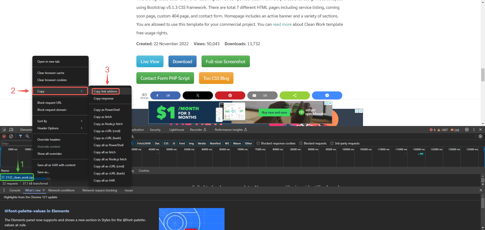

# Setup Multiple Static Websites on a Single Server Using Nginx Virtual Hosts

# Setup a Static Website Using Nginx

|S/N | Project Tasks                                                                            | Key Concepts Covered         |
|----|------------------------------------------------------------------------------------------|------------------------------|
| 1  |Install and configure Nignx on a server                                                   | Subdomains                   |
| 2  |Create two website directories with two different website templates.                      | Nginx Virtual Hosts routing. |
| 3  |Create two subdomains                                                                     | Wildcard SSL (Letsencrypt)   |
| 4  |Add the IP of the server as A record to the two subdomains.                               |                              |
| 5  |Configure the Virtual host to point two subdomains to two different website directories.  |                              |
| 6  |Validate the setup accessing the subdomains.                                              |                              |
| 7  |Create a wildcard Letsencrypt SSL certificate for the root Domain.                        |                              |
| 8  |Configure wildcard SSL on Nginx for two websites.                                         |                              |
| 9  |Validate the subdomain websites’ SSL using OpenSSL utility.                               |                              |

## Checklist

- [x] Task 1: Spin up a Ubuntu server & assign an elastic IP to it.
- [x] Task 2: SSH into the server and install and configure Nignx on a server.
- [x] Task 3: Create two website directories with two different website templates.
- [x] Task 4: Create two subdomains
- [x] Task 5: Add the IP of the server as A record to the two subdomains.
- [x] Task 6: Configure the Virtual host to point two subdomains to two different website directories.
- [x] Task 7: Validate the setup accessing the subdomains.  
- [x] Task 8: Create a wildcard Letsencrypt SSL certificate for the root Domain.
- [x] Task 9: Configure wildcard SSL on Nginx for two websites.
- [x] Task 10: Validate the subdomain websites’ SSL using OpenSSL utility.

## Documentation

Please reference [**Project1**](https://github.com/StrangeJay/DevOps_Projects/blob/main/DevOpsCube/project1/project1.md) for guidance on spinning up an Ubuntu server, as well as creating and associating an elastic IP address with your server, among other tasks.

- Spin up your ubuntu server, create an elastic IP and associate it to your instance.

### Install Nginx and Setup Your Website

- Execute the following commands.

`sudo apt update`

`sudo apt upgrade`

`sudo apt install nginx`

- Start your Nginx server by running the `sudo systemctl start nginx` command, enable it to start on boot by executing `sudo systemctl enable nginx`, and then confirm if it's running with the `sudo systemctl status nginx` command.

- Visit your instances IP address in a web browser to view the default Nginx startup page.

- Download your website template from your preferred website by navigating to the website, locating the template you want.

- Right click and select **Inspect** from the drop down menu.

- Click on the **Network** tab and then click **Download** button.

- Right click on the website name, select **Copy** and click on **Copy link address**.

- Execute the command to download and unzip your website files `sudo curl -o /var/www/html/2098_health.zip https://www.tooplate.com/zip-templates/2098_health.zip && sudo unzip -d /var/www/html/ /var/www/html/2098_health.zip && sudo rm -f /var/www/html/2098_health.zip`.

- Update your nginx configuration by running the command `sudo nano /etc/nginx/sites-available/cleaning`.

- Edit the `root` directive within your server block to point to the directory where your downloaded website content is stored.

- Update the nginx configuration for your second website by running the command `sudo nano /etc/nginx/sites-available/health`.

- Edit the `root` directive within your server block to point to the directory where your downloaded website content is stored.

- Create a symbolic link for both websites by running the following command.
`sudo ln -s /etc/nginx/sites-available/cleaning /etc/nginx/sites-enabled/`
`sudo ln -s /etc/nginx/sites-available/health /etc/nginx/sites-enabled/`

- Run the `sudo ngingx -t` command to check the syntax of the Nginx configuration file, and when successful run the `sudo systemctl restart nginx` command.

---

### Create An A Record

To make your website accessible via your domain name rather than the IP address, you'll need to set up a DNS record. I did this by buying my domain from Namecheap and then moving hosting to AWS Route 53, where I set up an A record.

> [!NOTE]
Visit [Project1](https://github.com/StrangeJay/DevOps_Projects/blob/f02b9151dd581eef3cec53c31e61066962e3641e/DevOpsCube/project1/project1.md) for instructions on how to create a hosted zone.

- In route 53, select the domain name and click on **Create record**.

- Paste your Elastic IP address and then click on **Create records**.

- Click on **create record** again, to create the record for your sub domain.

- Input the Record name, paste your Elastic IP address and then click on **Create records**.

- Repeat the same process while creating your second subdomain record, and confirm that they both exist in the records list.

- Open your terminal and run `sudo nano /etc/nginx/sites-available/cleaning` & `sudo nano /etc/nginx/sites-available/cleaning` to edit your settings. Enter the name of your domain and then save your settings.

- Run `sudo nano /etc/nginx/sites-available/health` & `sudo nano /etc/nginx/sites-available/health` to edit your settings. Enter the name of your domain and then save your settings.

- Restart your nginx server by running the `sudo systemctl restart nginx` command.

- Go to your domain name in a web browser to verify that your website is accessible.

> [!NOTE]
You may notice the sign that says **Not secure**. Next, you'll use certbot to obtain the SSL certificate necessary to enable HTTPS on your site.

---

### Install certbot and Request For an SSL/TLS Certificate

- Install certbot by executing the following commands:
`sudo apt update`
`sudo apt install python3-certbot-nginx`
`sudo certbot --nginx`

- Execute the `sudo certbot --nginx` command to request your certificate. Follow the instructions provided by certbot and select the domain name for which you would like to activate HTTPS.

- Visit `https://<domain name>` to view your websites.

- Verify the website's SSL using the OpenSSL utility with the command: `openssl s_client -connect cleaning.cloudghoul.online:443`

---
---

#### The End Of Project 2

If you encounter any errors or need assistance at any stage of the project, feel free to contact me via [**LinkedIn**](https://www.linkedin.com/in/jamillah-bello/). I'm here to help.
